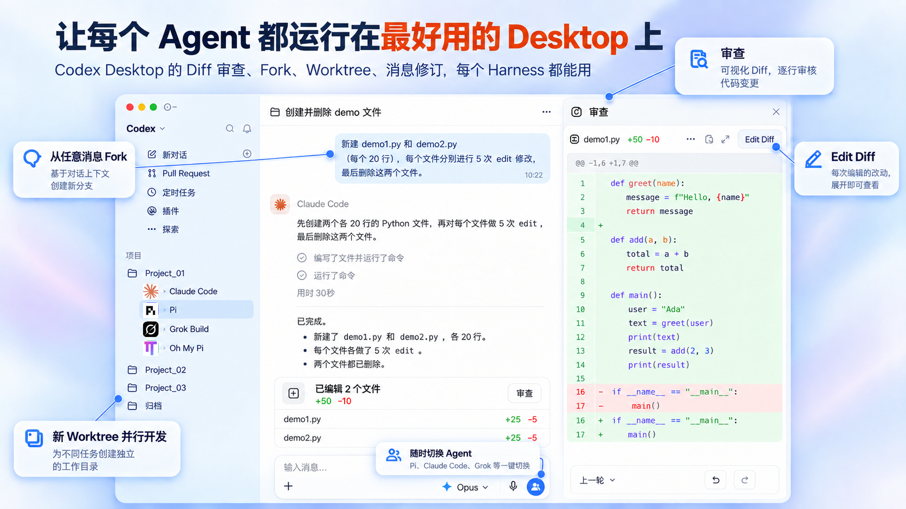
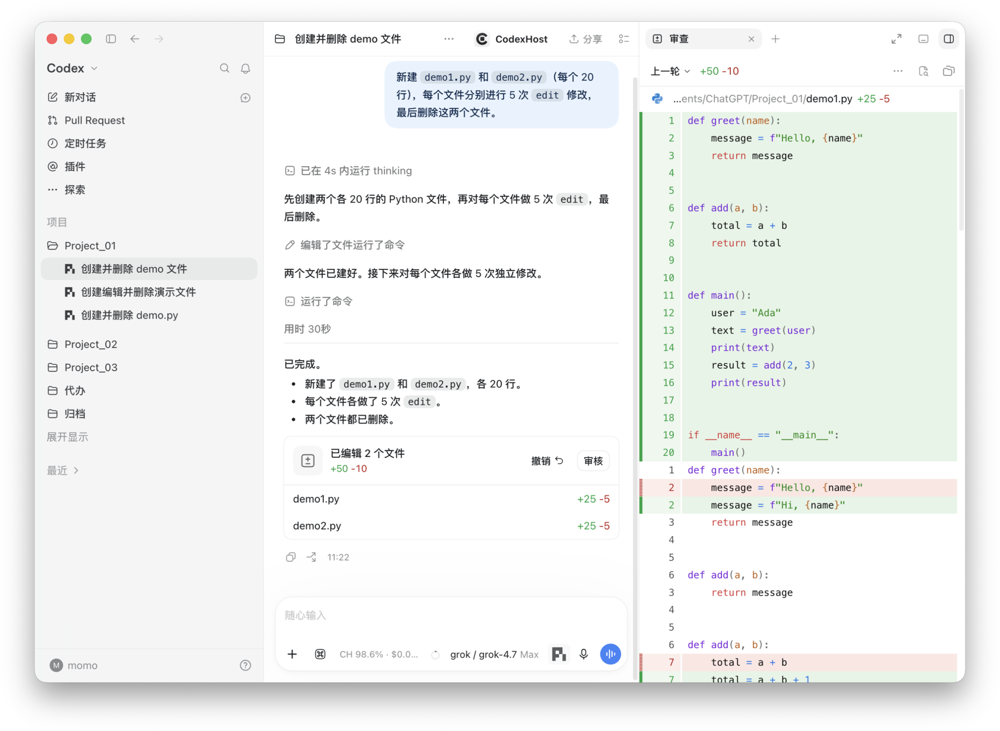
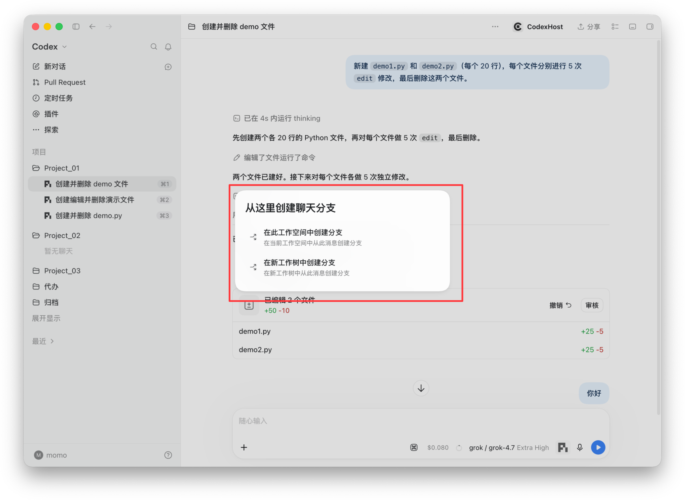
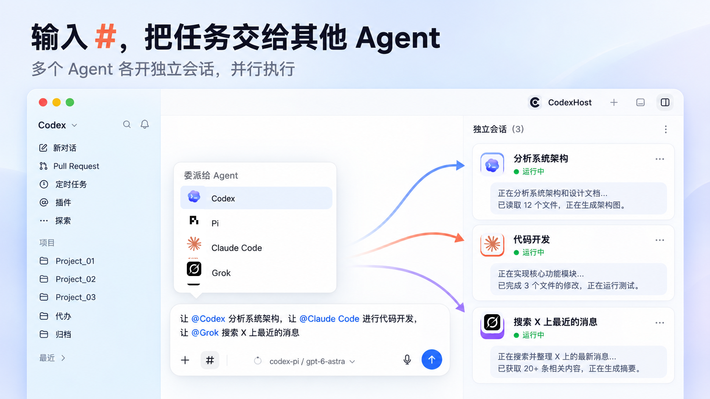
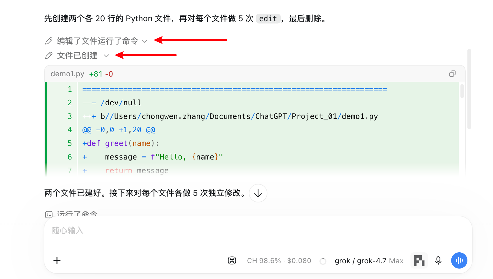
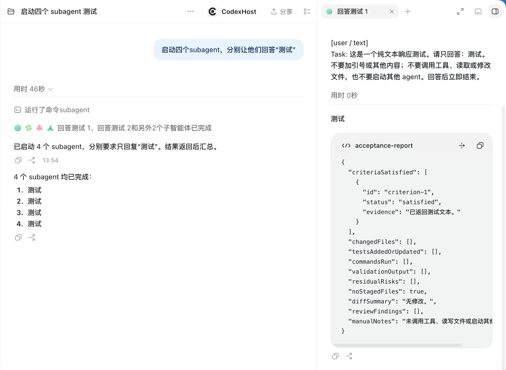
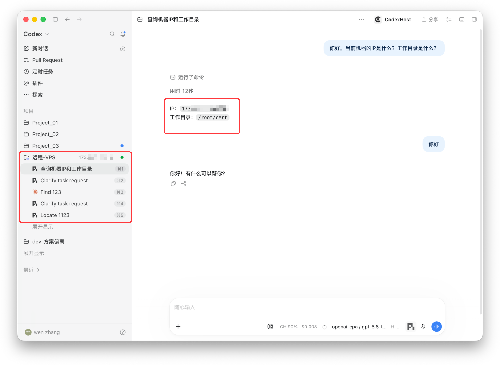
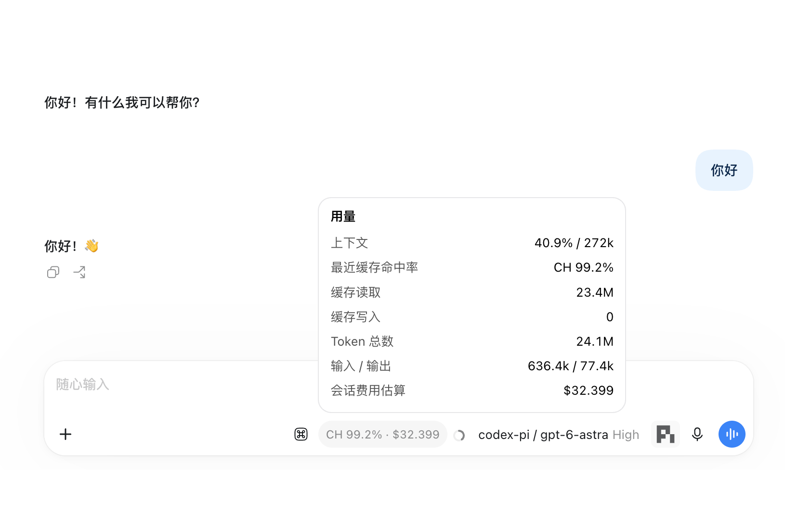
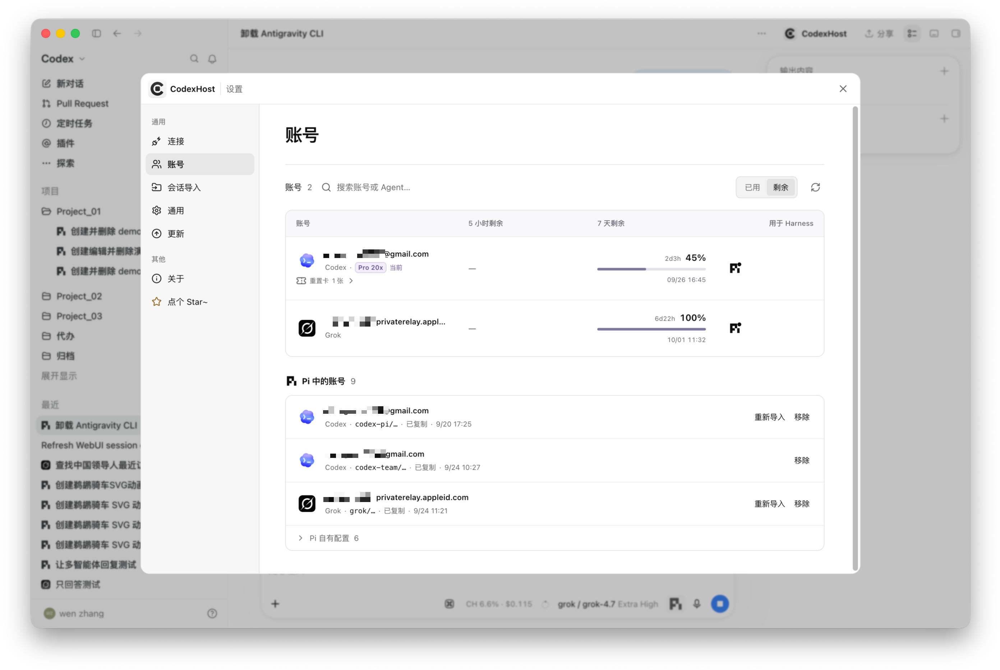
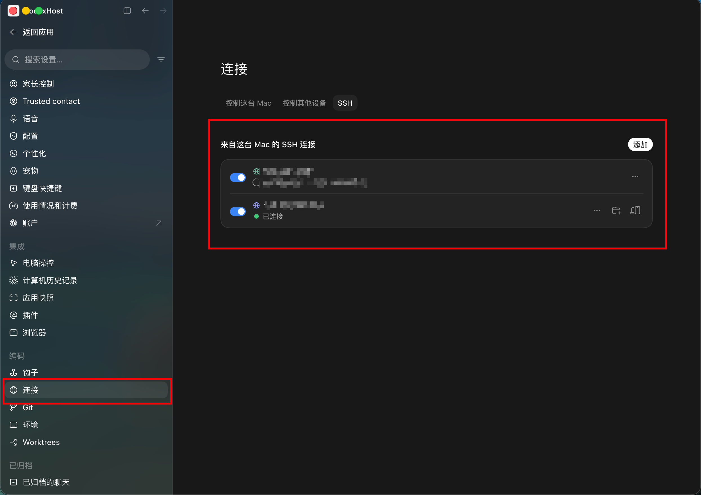

# Codex Buddy

[zjarlin/codex-buddy](https://github.com/zjarlin/codex-buddy) 是 [BytePioneer-AI/codex-host](https://github.com/BytePioneer-AI/codex-host) 的 fork（随上游使用 LGPL-3.0-only；Buddy engine 保留自身 MIT 许可），增加 Codex Buddy 的 **Auto Router、Git 智能体、IO 操作智能体和无模型命令旁路**。保留上游的多 Harness 功能。

默认由 **单个模型直接处理当前任务**，不再创建额外规划线程、生成执行任务包或自动分派子线程：

| 请求 | 默认执行方式 |
| --- | --- |
| 精确命令，如“当前目录”“查看 git 状态” | 命中项目已发现的入口后调用原生工具，不启动执行模型 |
| 范围明确的简单任务，如提交代码、改 README、启动项目 | 经济型模型直接处理，保留 Git / IO / 编码角色 |
| 复杂设计、跨模块修改 | 优先选择能力更强的模型，直接分析、实施和验收 |

每次需要模型的请求，都从 Codex 当前供应商配置的 `/v1/models` 获取候选，再与 App Server 可用目录取交集。GPT / Claude 也可直接执行，没有内置固定模型清单；名称启发式不代表实际价格或能力测评。可在 **设置 → 路由** 指定一个执行模型或自动选择。原生 Plan Mode、权限和审批不变。

## 隐私内容：只用自部署 q3

处理敏感信息前，在 **设置 → 路由** 启用 **隐私模式** 并保存，然后使用原生输入框。Host 阻止普通外部 Harness 任务、在线路由和非 q3 模型发送，仅允许自部署 `q3-4b`、`q3-14b`。

隐私对话复用 Codex 已配置的网关和凭据，从该网关的 `/v1/models` 动态取出 `q3-4b`、`q3-14b`。不需要额外配置。内容会进入 Codex 原生 Thread 历史；隐私模式不调用在线分类、普通旁路或在线自动续接，但并非完全断网，也不替代网关的模型映射与本机历史保护。

网关中的两个 q3 ID 必须映射到自部署模型；客户端只提交所选 q3，不会回退到在线模型。模型缺失或请求失败时停止。详见 [网关隐私通道与保护范围](docs/product/buddy-private-chat.md)。当前正在运行的官方桌面不会因源码更新自动具备此保护，需要从本 fork 启动并确认隐私模式已启用。

## 启动 Buddy 客户端

macOS 可从 [Buddy macOS DMG 构建](https://github.com/zjarlin/codex-buddy/actions/workflows/buddy-macos-dmg.yml) 下载成功运行的 Artifacts。Apple Silicon 选择 `macos-arm64`。解压后打开 DMG，将 `CodexBuddy.app` 拖到 Applications。需要先安装 Codex Desktop；保存任务、完全退出 Codex 后，启动 `codexhost`。

构建包包含 `SHA256SUMS.txt` 和标明源码提交的 `build-info.json`，可在解压目录执行 `shasum -a 256 -c SHA256SUMS.txt` 校验。预览包使用临时签名，未做 Apple 公证；首次打开如被拦截，按系统设置中的安全提示允许打开。Actions 产物保留 30 天，下载需要登录 GitHub。仓库维护者可通过 **Run workflow** 重新构建，或运行：

```bash
gh workflow run buddy-macos-dmg.yml --repo zjarlin/codex-buddy --ref main -f target=macos-arm64
```

预览工作流仅支持 Apple Silicon；Intel Mac 可使用上游或正式发行版安装包，或在 macOS 主机上本地构建 `macos-arm64`。

也可使用源码启动，需要 Node.js 22+、npm、Rust 工具链和已安装的 Codex Desktop：

```bash
git clone https://github.com/zjarlin/codex-buddy.git
cd codex-host
npm ci
npm start
```

`npm start` 会构建并重新启动 Codex Desktop。再次启动可运行 `npm start -- --no-build`。先结束或保存当前正在执行的任务。

进入 **Codex** 执行链，在 **Codex Buddy 设置 → 路由** 管理自动路由、隐私、旁路、System One 判断、JEV 连接、执行角色和执行模型。输入区不再显示 Auto Router 设置面板；收藏模型和独立会话恢复入口保留。关闭“自动路由”后恢复手动选模。

这些 UI 和运行时能力由本 fork 的 launcher、Host 与 renderer 扩展提供。只运行 `npx -y codex-buddy` 不会为已打开的官方客户端添加这些功能。原 CLI 的模型同步用法继续独立存在；也可从收藏模型菜单手动刷新目录。

不改写官方 app 的安装文件。官方更新后仍使用新的 Codex，GUI 注入若遇到上游结构变化，需要更新本 fork 的适配。Buddy 的更新源已指向 `zjarlin/codex-buddy`；Actions 预览包需手动下载更新，不会通过正式 Releases 自动更新。以下保留上游功能介绍与示例。

详见 [Auto Router 用法与边界](docs/product/buddy-auto-router.md)。

---

<div align="center">

# CodexHost

**Run Pi and other Harnesses inside Codex Desktop**

We believe **Codex Desktop** offers the best desktop development experience today.

But **Codex** isn't the only great **Agent Harness** — **Claude Code** and **Pi** are great too.

**CodexHost** lets you run other **Harnesses** natively inside **Codex Desktop** and have them work together.

⭐ If CodexHost is useful to you, please give it a star! ⭐

<p>
  <a href="https://pi.dev/"></a>
  <a href="https://openai.com/codex/"></a>
  <a href="https://code.claude.com/docs/en/quickstart"></a>
  <a href="https://opencode.ai/docs/"></a>
  <a href="https://grok.com/"></a>
  <a href="https://github.com/can1357/oh-my-pi"></a><br />
  <a href="https://github.com/deepseek-ai/deepseek-harness"></a>
  <a href="https://antigravity.google/product/antigravity-cli"></a>
  <a href="https://kiro.dev/docs/cli/"></a>
  <a href="https://www.codebuddy.cn/home/"></a>
  <a href="https://www.workbuddy.ai/docs/workbuddy/Quickstart"></a>
  <a href="https://cursor.com/docs/cli/overview"></a>
  <a href="https://hermes-agent.nousresearch.com/docs"></a>
  <a href="https://qoder.com/cli"></a>
  <a href="https://moonshotai.github.io/kimi-code/"></a>
</p>
<br />

<p align="center"><a href="https://github.com/BytePioneer-AI/codex-host/releases"><strong>Download</strong></a> · <a href="#cross-agent-collaboration">Cross-Agent Collaboration</a> · <a href="#remote-harness">Remote</a> · <a href="#join-the-community">Community</a> · <a href="docs/project/README.zh-CN.md">简体中文</a> · <a href="docs/project/README.ko.md">한국어</a></p>

<br />

</div>

## Interface Preview

No more switching apps: **Pi, Claude Code, Grok Build, and ten-plus other Harnesses** all run right inside the same Codex Desktop window.

https://github.com/user-attachments/assets/c48192d7-23ff-4f6e-b61a-6345a655bb76

### Interface

<div align="center">
  
</div>

## Quick Start

**Option 1: npm** (macOS / Windows / Linux)

Buddy macOS 预览包见 [GitHub Actions 构建](https://github.com/zjarlin/codex-buddy/actions/workflows/buddy-macos-dmg.yml)，安装步骤见本文开头。上游 macOS / Windows 安装包见 [上游版本](https://github.com/BytePioneer-AI/codex-host/releases/latest)，不包含本 fork 的 Buddy 改动；正式 Buddy 发行版将在 [本 fork 的 Releases](https://github.com/zjarlin/codex-buddy/releases) 提供。

<details>
<summary>Installation troubleshooting</summary>

**macOS: "App can't be verified" on first launch**

```bash
xattr -dr com.apple.quarantine /Applications/CodexBuddy.app
```

**Windows: using a portable Codex Desktop**

1. Point `CODEXHOST_INSTALL_ROOT` at the folder where you extracted Codex Desktop:

   ```powershell
   [Environment]::SetEnvironmentVariable("CODEXHOST_INSTALL_ROOT", "D:\CodexPortable", "User")
   ```

2. Quit Codex Desktop completely, open a new terminal, and run `codexhost`.

</details>

### Highlights

<table>
  <tr>
    <td colspan="2" valign="top">
      <p><strong>Full workspace</strong><br /><sub>Sessions from different Harnesses share one sidebar; switch Agents from the bottom-right of the composer</sub></p>
      <div align="center">
        
      </div>
    </td>
  </tr>
  <tr>
    <td width="50%" valign="top">
      <p><strong>Diff review panel</strong><br /><sub>Every turn summarizes its changes; click Review to open the full Diff on the right</sub></p>
      
    </td>
    <td width="50%" valign="top">
      <p><strong>Fork from any message</strong><br /><sub>Branch in the current workspace, or in a new Worktree for parallel work</sub></p>
      
    </td>
  </tr>
  <tr>
    <td width="50%" valign="top">
      <p><strong>Delegate to other Agents with #</strong><br /><sub>Each Agent runs in its own session, in parallel · <a href="#cross-agent-collaboration">Learn more</a></sub></p>
      
    </td>
    <td width="50%" valign="top">
      <p><strong>Tool calls and thinking</strong><br /><sub>Expand any edit, command, or thinking step to see the details</sub></p>
      
    </td>
  </tr>
  <tr>
    <td width="50%" valign="top">
      <p><strong>Visible Subagents</strong><br /><sub>Each Subagent has its own icon; open its full conversation on the right</sub></p>
      
    </td>
    <td width="50%" valign="top">
      <p><strong>Remote development</strong><br /><sub>Add a VPS as a project and run Agents directly on the remote machine · <a href="#remote-harness">Learn more</a></sub></p>
      
    </td>
  </tr>
  <tr>
    <td width="50%" valign="top">
      <p><strong>Usage at a glance</strong><br /><sub>Cache hit rate, cost estimate, and context usage, live</sub></p>
      
    </td>
    <td width="50%" valign="top">
      <p><strong>One-click account import</strong><br /><sub>Copy your locally signed-in Codex and Grok credentials to Pi, with live quota</sub></p>
      
    </td>
  </tr>
  <tr>
    <td colspan="2" valign="top">
      <p><strong>Mermaid diagram rendering</strong><br /><sub>Left: Codex Desktop + Pi renders the diagram; right: the Pi TUI only shows the source</sub></p>
      
    </td>
  </tr>
</table>

## Feature Status

Every Harness gets Codex Desktop's native Edit Diff, Fork, message editing, and slash commands.

<details>
<summary>Show full feature matrix</summary>

| Capability | <a href="https://pi.dev/"></a> | <a href="https://github.com/can1357/oh-my-pi"></a> | <a href="https://code.claude.com/docs/en/quickstart"></a> | <a href="https://opencode.ai/docs/"></a> | <a href="https://grok.com/"></a> | <a href="https://github.com/deepseek-ai/deepseek-harness"></a> | <a href="https://antigravity.google/product/antigravity-cli"></a> | <a href="https://www.codebuddy.cn/home/"></a> | <a href="https://www.workbuddy.ai/docs/workbuddy/Quickstart"></a> | <a href="https://cursor.com/docs/cli/overview"></a> | <a href="https://hermes-agent.nousresearch.com/docs"></a> | <a href="https://qoder.com/cli"></a> | <a href="https://moonshotai.github.io/kimi-code/"></a> |
| :--- | :---: | :---: | :---: | :---: | :---: | :---: | :---: | :---: | :---: | :---: | :---: | :---: | :---: |
| Streaming responses | ✅ | ✅ | ✅ | ✅ | ✅ | ✅ | ✅ | ✅ | ✅ | ✅ | ✅ | ✅ | ✅ |
| Tool status | ✅ | ✅ | ✅ | ✅ | ✅ | ✅ | ✅ | ✅ | ✅ | ✅ | ✅ | ✅ | ✅ |
| Edit Diff | ✅ | ✅ | ✅ | ✅ | ✅ | ✅ | ✅ | ✅ | ✅ | ✅ | ✅ | ✅ | ✅ |
| Questions / cancellation | ✅ | ✅ | ✅ | ✅ | ✅ | ✅ | ✅ | ✅ | ✅ | ✅ | ✅ | ✅ | ✅ |
| Model / Thinking selection | ✅ | ✅ | ✅ | ✅ | ✅ | ✅ | ✅ | ✅ | ✅ | ✅ | ✅ | ✅ | ✅ |
| Tool approvals | ✅ | ✅ | ✅ | ✅ | ✅ | ✅ | — | ✅ | ✅ | ✅ | ✅ | ✅ | ✅ |
| Permission modes | — | ✅ | ✅ | ✅ | ✅ | ✅ | ✅ | ✅ | ✅ | ✅ | ✅ | ✅ | ✅ |
| Cross-Agent task collaboration | ✅ | ✅ | ✅ | ✅ | ✅ | ✅ | ✅ | ✅ | — | ✅ | ✅ | ✅ | ✅ |
| Usage | ✅ | ✅ | ✅ | ✅ | ✅ | ✅ | ✅ | ✅ | ✅ | — | ✅ | ✅ | ✅ |
| Fork | ✅ | ✅ | ✅ | ✅ | ✅ | ✅ | ✅ | ✅ | ✅ | ✅ | ✅ | ✅ | ◐ |
| Context compaction | ✅ | ✅ | ✅ | ✅ | ✅ | ✅ | — | ✅ | ✅ | — | ✅ | ✅ | ✅ |
| Slash commands | ✅ | ✅ | ✅ | ✅ | ✅ | ✅ | ✅ | ✅ | ✅ | ✅ | ✅ | ✅ | ✅ |
| Edit previous message | ✅ | ✅ | ✅ | ✅ | ✅ | ✅ | ✅ | ✅ | ✅ | ✅ | ✅ | ✅ | ✅ |

</details>

## Cross-Agent Collaboration

Type `#` in the chat input to choose an Agent to delegate a task to, or to find commands and skills available for the selected Harness.

Ask the current Agent to hand off a self-contained task to another Harness. For example:

> Have `#claude-code` review this change on its own and flag any compatibility risks.
>
> Have `#pi` figure out why this test is flaky.
>
> Have `#omp` implement this feature while I keep working on the docs.
>
> Have `#opencode` verify this fix in a separate Thread and run the related tests.

CodexHost spins up a separate Native Session in the target Harness. It shows up in the Codex Desktop conversation list, so you can open it anytime to check progress or pick up the conversation.

<details>
<summary><h3 id="remote-harness">Remote Harness</h3></summary>

Drive Harnesses on another machine from your local Codex Desktop: tasks run remotely, the UI stays local. Both machines need the same codexhost version.

| Remote machine | How to connect |
| --- | --- |
| macOS / Linux | [SSH](#ssh) |
| Windows | [Remote Control](#remote-control-experimental) (experimental) |

#### SSH

Before you start, add the remote machine in Codex Desktop under **Settings → Connections → SSH**. Your local machine can run macOS, Linux, or Windows.

<div align="center">
  
</div>

1. Install and start codexhost on the remote machine:

   ```bash
   npm install -g @codexhost/cli
   codexhost remote install
   codexhost remote start
   codexhost remote status
   ```

2. On your local machine, launch Codex Desktop through codexhost and open the SSH workspace.
3. Pick a Harness from the composer's Agent / Model selector.

[SSH setup, diagnostics, and uninstall →](docs/platforms/remote/remote-ssh-host.md)

#### Remote Control (Experimental)

Use Harnesses on a Windows machine from another computer, built on the pairing and sign-in of Codex Desktop's official Remote Control.

Before you start, make sure official Remote Control can already run Codex tasks. No public services or ports are opened, and Harness credentials never leave the Windows machine.

[Remote Control setup, transport boundary, and diagnostics →](docs/platforms/remote/remote-control-host.md)

</details>

<details>
<summary><h3>How it works</h3></summary>

Most multi-agent clients build their own chat UI and plug Harnesses in through a common protocol.

CodexHost does it differently:

- **Desktop:** extends the official Codex Desktop via CDP / Electron Inspector — no rebuilt chat UI, no patched installer.
- **Protocol:** a CLI Shim sits in front of the official app-server and passes native Codex requests through untouched.
- **Harnesses:** each Harness is integrated through its own native interface where one exists (Pi over RPC, Claude Code via the Agent SDK), falling back to [ACP](https://agentclientprotocol.com/) otherwise. Streaming, tool status, diffs, approvals, and questions all render in Codex Desktop's native UI.
- **Orchestration:** delegated tasks run as independent native sessions in the target Harness; the caller can wait for the result or let it run in the background.

</details>

## Join the Community

<table align="center">
  <tr>
    <td>
      <strong>Join the Community</strong><br />
      <sub>Scan the QR code to join our WeChat group and chat about CodexHost.</sub>
      <ul>
        <li><sub>Get help with installation</sub></li>
        <li><sub>Share feature ideas and feedback</sub></li>
        <li><sub>Talk about development</sub></li>
        <li><sub>For bugs, please open an <strong>issue</strong></sub></li>
      </ul>
      <sub><strong>Contributions are welcome.</strong></sub>
    </td>
    <td align="center">
      
    </td>
  </tr>
</table>

## Development

Please read the [contributing guide](CONTRIBUTING.md) before opening an issue or PR. See [repository maintenance automation](docs/operations/repository-maintenance.md) for PR title labels, CI summaries, and pre-release checks.

Requirements: the official Codex Desktop, Node.js 22.19+ or 24, and Rust.

```bash
git clone https://github.com/BytePioneer-AI/codex-host
cd codex-host
npm ci
npm start
```

### Runtime Architecture

Using Pi as an example, here is how a single request flows from left to right: Desktop → shared layer → Pi plugin → native process.

<div align="center">
  
</div>

### Adding a Harness

Most of the work is implementing the plugin's Manifest, factory, Adapter, and Session, plus the native communication and translation logic. The Renderer still has some hard-coded wiring, so full Desktop integration takes extra work.

Tip: point your coding Agent at the in-repo [codexhost-add-harness Skill](.agents/skills/codexhost-add-harness/SKILL.md). It covers plugin structure, the shared Adapter interface, capability implementation, and testing requirements.

## Acknowledgements

- Thanks to the [LINUX DO](https://linux.do/) community for their ongoing support.
- Thanks to [Paseo](https://github.com/getpaseo/paseo), whose approach to multi-Harness integration and architecture inspired ours.

## Star History

<a href="https://www.star-history.com/?repos=bytepioneer-ai%2Fcodex-host&type=date&legend=top-left">
  <picture>
    <source media="(prefers-color-scheme: dark)" srcset="https://api.star-history.com/chart?repos=bytepioneer-ai/codex-host&type=date&theme=dark&legend=top-left" />
    <source media="(prefers-color-scheme: light)" srcset="https://api.star-history.com/chart?repos=bytepioneer-ai/codex-host&type=date&legend=top-left" />
    
  </picture>
</a>
