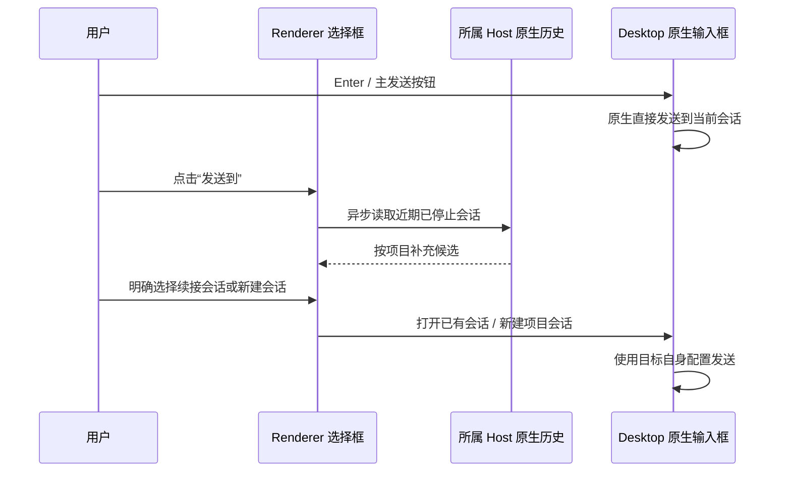

# Buddy Auto Router

本功能属于 `zjarlin/codex-buddy` fork。通过源码根目录的 `npm ci`、`npm start` 启动；启动命令会重新打开桌面端。配置入口是 Codex Buddy 设置窗口的“路由”页，使用当前 Host 的配置。输入区不再挂载 Auto Router 设置面板，也不轮询路由状态；收藏模型与会话恢复独立保留。

## 会话中的 Auto routed 卡片

使用支持扩展的 Sub2API Provider、请求模型为 `auto` 时，会话内每个回合显示醒目的 `Auto routed` 卡片。大字展示实际响应模型，状态区分正在尝试、响应中、已完成、失败与中断；展开可看同回合各请求的模型尝试顺序、回退次数和时间。工具循环中的多次请求合并在一张卡片，主显示采用最新请求的结果。响应前仅显示当前候选，不宣称执行成功；没有实际模型字段时保留最后尝试的模型名。

最新请求有候选计划时，卡片同时展示可用路由数和总数，展开可搜索模型、别名和平台，查看完整降级顺序及排除原因。网关优先 DeepSeek V4.1 Flash，接着 GLM 等经济型模型，再按能力档位回退到其余候选；客户端只展示网关计划。候选计划来自 Key 有权访问的分组内全部已配置/已同步模型，未评级、尚无成功记录的模型不会因此消失。候选资格不代表实际成功；专用模型、策略排除和暂无兼容账号会明确标注。

这与 Buddy 的发送前单模型选模独立，即使关闭 Auto Router，只要原生请求使用网关 `auto`，卡片仍可显示。卡片是客户端独立视图，不注入 assistant 文本，不修改上下文或模型设置，也不冒用原生 `model/rerouted` 的安全告警语义。

网关通过原生 `X-Codex-Turn-Metadata` 中的 `thread_id`（旧版本回退到 `session_id`）与 `turn_id` 关联请求，在 PostgreSQL 按 API Key、会话和回合持久化。`GET /v1/auto/routes?session_id=<uuid>&run_id=<turn-id>` 使用原 Provider API Key 鉴权；run_id 可省略以读取整个会话最近记录，也可指定以找回旧回合。run_id 与兼容字段 turn_id 相同，request_id 区分一轮里的多次模型请求。仅返回路由模型、标识、状态及毫秒时间戳，不返回提示词、密钥或上游账号。每次查询最多 128 个请求，数据库不按这个上限删除历史，也不设 Redis 七天过期。旧请求不会追溯补录，写入失败不改变原响应。

同一会话的相同候选计划通过 `plan_id` 去重保存，每次查询仅最新请求携带完整 `candidates`，历史记录保留摘要。查询条数上限 128 不限制每次请求的模型尝试数量，Host 仍对响应总字节数设限。Host 方法 `codexhost/auto/routes` 接受 threadId 和可选 runId，并核对返回会话和回合身份。旧网关缺少候选字段时，卡片照常显示实际模型和尝试记录。

Renderer 通过当前 Host 的 `codexhost/auto/routes` 读取，Host 先核对原生 Thread 的 Provider，再读取该 Host 的凭据。可见会话每两秒刷新最近记录，并按已挂载原生回合的 `turn_id` 补查，每批最多四个回合；活动记录每两秒更新，完成或暂无记录的回合每三十秒更新，因此旧回合不会因会话最近 128 条的限制丢失。隐藏窗口暂停；切换 Host、会话或连接后丢弃旧回包。会话内卡片必须匹配原生 Thread/turn DOM 标识，不挂载到无法确认归属的消息。选择 `auto` 后，输入框前会显示读取中、等待网关记录、Host 不支持、供应商不支持或读取失败的提示；无法读取记录时不猜测实际模型。已确认属于当前会话的最新路由在回合 DOM 出现前先显示在输入框前，匹配回复节点出现后移入对应回合，不重复展示。临时读取失败保留已有卡片并标记更新不可用。隐私模式禁止在线读取，也不显示选模提示。

官方 SSH app-server 明确不支持 `codexhost/auto/routes` 时，Renderer 先通过该连接的 `thread/read` 取得原生会话 ID、Provider 和 rollout 路径，再调用本机 Host 的专用 `codexhost/ssh/auto/routes`。Host 只使用 Desktop 保存的 SSH 连接，将内置的只读查询程序通过标准输入交给远端 Node.js 执行；远端 PATH 中需要 Node.js 18 或更高版本。程序从原生 rollout 路径确定远端 Codex 配置目录，核对持久化会话及 Provider，读取该目录的隐私设置和凭据，再查询上游。远端不需安装 Buddy 服务，也不会写入程序文件或重启会话。仅路由元数据回到 Renderer，凭据不经过浏览器；不会使用本机 Provider 配置替代远程配置。Provider 所需的环境凭据必须可由远端 SSH 环境读取，缺失时报告读取失败。网络或业务错误不触发这条回退路径。

需要支持观察接口的 Sub2API 网关及更新后的 Codex Buddy Host/Renderer；原生 SSH 连接可通过上述只读通道获取记录。原版 Codex CLI/Desktop 不具备此卡片；不支持回合元数据的旧内核不会产生可关联记录，未使用 `auto` 的请求也没有 Auto 记录。交付遵循仓库发布流水线；源码构建通过不等于正在运行的 MacBook 应用已升级。

## System One 判断与回合动作

回合下方另有“System One／回合动作”卡片，展示判断模型、项目特征、推荐置信度和最多三个主要动作。它与 `Auto routed` 共用回合锚点：Auto 卡片继续展示初选、实际响应及回退模型；System One 是辅助判断，不冒充执行模型，也不改变 Auto 调度。没有网关判断时仍显示注册动作。

Host 提供 `codexhost/thread/actions/inspect` 和 `codexhost/thread/action/execute`。内置“提交代码”使用明确禁止推送的 Prompt；“提交并推送”复用项目 Git 工作流。已有 Harness `commandCatalog`／`session.commands` 贡献原生命令，插件还可通过可选 `actionCatalog` 注册 Prompt 或命令，见 [Harness 命令契约](../architecture/harness-command-integration.md#turn-actions)。点击完整动作立即在当前聊天执行；文本参数用卡片内表单填写，保留 Composer 草稿。更多原生命令进入已有命令菜单。

仅最新已结束回合可执行，历史卡片只读；Host 在执行前再次验证 Thread 归属、版本、参数、能力、忙闲、已知 Plan Mode 和项目状态。执行端保留 Harness 原生权限与审批。隐私模式隐藏动作卡片，拒绝动作及旁路推荐请求。没有原生命令能力的连接不提供可执行命令入口。

旁路推荐使用当前 Host 的 Provider 与凭据：先读取 `GET /v1/turn/actions?session_id=…&run_id=…&context_id=…`，没有记录才调用 `POST /v1/turn/actions/recommend`。`run_id = turn_id`，`context_id` 为目录版本和结构化特征摘要。仅发送候选 ID、版本、标签、说明与 Git 改动／冲突／ahead／behind 数量；不发送聊天正文、文件路径、diff、Prompt 模板或参数。上下文相同的并发请求合并，单次三秒预算，超时或失败不阻塞主对话、不因卡片轮询重新生成。历史回合只读持久化推荐。旧网关返回 404／405 时降级为本地目录。

网关按 API Key、session、run、context 隔离保存判断；Host 独立在 `CODEXHOST_DATA_DIR/turn-actions`（默认 `~/.codexhost/turn-actions`）保存 `invocationId`、`sourceTurnId`、`executionTurnId` 与状态，不保存 Prompt 或参数原文。同一次点击重试复用 invocationId；原子受理后才调度，重复请求读取已有结果。完成状态来自真实 Harness 回合事件或恢复后的回合查询。连接中断且无法确认启动时显示“状态待确认”，不会自动重放提交等动作；模型 HTTP 成功不表示 Harness 回合或 Git 验收成功。

原生 SSH 缺少动作 RPC 时复用已验证的固定观测 Worker：远端核验 rollout 与 Provider，远端读取凭据和隐私设置、查询推荐并保存执行记录；当前原生连接负责 `turn/start` 和真实状态查询。此模式仅暴露提交／推送 Prompt 回退，不伪造 Harness 命令能力。Host／连接切换后丢弃迟到视图，已发起结果写回原目标。远端需 Node.js 18+，不会自动安装插件或重启应用。

外部 Harness 尚未提供可验证的 Provider 身份时，保留本地动作与原生命令，不代用 Codex Provider 查询网关。首版没有插件热装卸、后台自动执行动作、独立动作执行器或 System One 调度策略改写。网关迁移与部署、真实 Desktop／SSH 验收独立于源码测试。

## 收藏与固定模型

输入框上方的“收藏模型”提供搜索和收藏管理，收藏即 Pin，已收藏模型直接显示为 chip，右侧的 × 可直接取消收藏。收藏按 Harness 的模型 ID 分开存储，重启后保留；收藏操作本身不切换模型。发现收藏不在目录时自动走已有同步与目录刷新流程，同一 Host/会话/Harness 上下文中每个缺失 ID 只尝试一次，不因重绘反复请求；后台恢复不阻塞模型选择和收藏管理，不自动发起可用性探测。支持自定义模型 ID 时不显示“目录未列出”，即使上游仍未列出也保留 ID 并允许选择；不支持自定义 ID 的 Harness 保留缺失提示并禁用选择。真正的同步失败仍显示原因，并可手动刷新重试。收藏不会因为上游返回数量减少而消失或替换成其他模型。原生模型菜单继续保留。

Codex 的收藏菜单支持在搜索框手动输入模型 ID：“使用此 ID”立即选择，作用于下一次发送；“Pin 此 ID”只保存收藏。ID 去除首尾空白后保留大小写和 `/` 等字符。目录未列出甚至目录为空时，也能显式选择该 ID，无需刷新目录或重启 Codex。Pin 不要求供应商当前可调度，不把手填 ID 加入供应商目录或 Auto Router 候选；真实可用性和错误由当前 Provider 的请求结果决定。外部 Harness 保留缺失收藏但禁用选择，仍只通过自身模型目录和选择接口使用模型。

目录外 ID 面向允许自定义模型的 Provider，沿用当前 Provider 和认证，不自动切换供应商。当前原生桌面端在新建任务使用 ChatGPT 认证与内置 OpenAI Provider 时，会将目录外 ID 归一到默认模型；自定义 Provider 不受此目录回退限制。已有任务通过原生下一回合设置切换，正在执行的回合保持原模型。

收藏栏旁和收藏菜单搜索框旁均提供“刷新模型”。Codex 先调用已安装的 Buddy 同步器，从当前配置供应商的 `/models` 更新 `model_catalog_json`。Host 校验当前自定义 Provider 与原生可用状态后，原子发布新目录，让 Desktop 和 Auto Router 的后续 `model/list` 查询使用同一份热目录；每次查询仍经过原生的管理策略与认证检查。随后界面通过原生 QueryClient 重新查询，最多等待两秒让 React 提交同步后的完整 ID 集合，包含新增、移除和空目录。若仍未完全匹配，只报告当前实际同步条数，不将缺失 ID 判为不可用，也不要求用户重启。外部 Harness 使用其 `inspectHarness(refresh: true)` 接口。更新不停止正在执行的任务。

刷新不修改当前模型、思考强度、收藏或路由设置。相同 Host 的并发同步请求合并为一次，同步过程不阻塞其他桌面请求。刷新期间保留已打开菜单和搜索内容；同步、目录验证或 Provider 校验失败时保留之前的目录，显示原因并允许重试。切换 Host、会话或 Harness 后不发布旧请求的结果；Provider/目录配置或认证改变会使热目录失效。隐私模式拒绝在线同步。

刷新成功后保留结果摘要。Codex 收藏菜单显示原生目录同步条数及相对刷新前的新增/移除；外部 Harness 显示同步条数及新增/移除。模型刷新和收藏入口独立于单模型路由，Auto Router 面板不再重复提供刷新操作。没有可用计数时只显示“模型列表已刷新”，不把菜单条数伪装成供应商返回数量。

收藏菜单另有“探测全部模型”，仅点击时执行。支持扩展接口的 Host 读取当前 `config.toml` 配置的 Provider，取其 `/models` 与菜单目录、收藏 ID 的并集，每个模型发送一次最小文本请求。探测范围不受搜索、当前 tab 或是否收藏影响，不创建 Thread、不修改选模或 Auto Router 设置。采用 Provider 配置的 Responses 或 Chat Completions 协议，最多四个并发，每个请求最多等待 15 秒；有效模型回复才算可用，HTTP 错误、业务错误、空响应和超时归为本次探测不可用。结果表示该 Provider 下这次文本请求的结果，不代表工具、多模态或未来请求的保证。

探测结果按“可用”“不可用”“未探测”tab 展示，支持继续搜索和收藏，并显示探测时间与失败原因。Host 通过 `codexhost/models/availability` 的 `probe` 操作生成并持久化快照，`read` 只读本地结果；打开菜单、重新启动、目录刷新和 Auto Router 均不会重新探测，也没有定时刷新。新出现的模型保留为未探测，下一次手动探测完成后整体替换结果；整批失败保留上次结果。快照按 Host、Provider 连接及本地认证配置隔离，切换连接或账号后不套用旧结论，切换会话时忽略迟到的界面响应。该扩展接口支持配置 API 凭据的 Codex Provider；仅 ChatGPT OAuth 登录或外部 Harness 的原生探测能力尚不支持，隐私模式拒绝在线探测。

读取快照不会执行认证命令。使用 `auth.command` 且凭据在命令外部轮换时，本地配置未变化无法判断账号是否改变；需手动重新探测更新结果。

远程原生连接未实现 `codexhost/models/availability` 时，收藏菜单使用同一连接的原生接口探测，不读取桌面所在机器的配置、凭据或缓存，也不要求其安装命令行程序。打开菜单只读取当前连接内的结果；点击探测后，合并远程 `model/list` 的所有分页与菜单、收藏 ID，最多四路并发，为每个模型创建只读临时 Thread，禁止模型回退并发送简短文本。只有原生回合成功完成且包含非空模型回复才计为可用；目录存在、创建 Thread 成功、空回复和替代模型均不算可用。每个模型最多等待 15 秒，超时尝试中断，结束后取消订阅并释放临时 Thread，不向用户当前聊天发送探测消息。

原生探测衡量的是该模型通过当前远程 Codex Provider 和认证运行的结果，可能包含原生协议约束及请求重试，不等同于直接 Provider HTTP 探测。此路径不需要读取 API Key，也适用于原生认证支持的模型。结果仅在当前请求客户端内存保留，重新连接或重启后显示未探测；读取结果和整批完成时核对远程配置与账号，变化时丢弃旧结果。原生账号接口不暴露 API Key 身份，因此同类型凭据在外部轮换但配置不变时仍需手动重新探测。不支持结果通知的连接会明确报错；网络错误或扩展接口的业务错误不触发原生回退。

此入口只执行一次已安装同步器的同步，不安装后台任务，也不改写供应商连接配置。热更新覆盖模型目录、菜单元数据和后续选模；原生 App Server 启动时读入的会话执行元数据仍由原生管理，刷新不会重建运行中的会话。若目录已同步但界面在两秒内仍未发布完整列表，显示真实返回/载入数量并提示重试刷新；急需发送时仍可使用手填 ID 或 Pin。供应商返回数量减少时如实显示目录变化，Pin 独立保留且不计入同步条数。分页游标绑定目录版本及隐藏项筛选，更新后的旧游标明确报过期，调用方从第一页重新查询。

点击 Codex 模型 chip 或“使用此 ID”时，先关闭当前 Host 的 Auto Router 接管和隐私改写，再调用当前原生菜单的模型选择回调。目录中已知模型保留受支持的思考强度，不支持时沿用原生菜单的模型默认值；目录外 ID 不推测能力或继承旧模型的思考强度，交由原生选择流程处理。原生禁用、模型锁定和选择前检查仍生效。配置失败会显示错误并保留原模型；会话或 Host 切换后不对旧目标继续应用选择。配置完成前禁止发送，防止消息抢先使用旧模型。

固定模型选择后，后续原生请求不经过 Host 接管、评级、模型改写、命令旁路或自动续接。此开关沿用 Host 级持久设置，同一 Host 的其他 Codex 会话也不自动路由，正在执行的回合不换模型。执行模型偏好保留；在设置窗口重新开启自动路由即可恢复策略。外部 Harness 的 chip 通过该 Harness 的现有选择接口切换。

路由配置集中在设置窗口。中断恢复列表独立放在收藏模型上方，始终展开，侧边栏会话状态图标也可恢复。

## 隐私优先

[隐私开关](buddy-private-chat.md) 优先于普通 Auto Router。开启后仍使用原生对话输入框，但不走在线分类、普通自动选模或命令旁路；Host 自动选择可用的自部署 `q3-4b` 或 `q3-14b` 发起原生 `turn/start`，无需手动选择模型。关闭 Auto Router 不会关闭隐私保护；关闭隐私开关后恢复普通路由。

## 单模型路由

Host 不再创建独立规划线程、结构化任务包或按任务图自动分派子线程。每次原生回合只选择一个执行模型，直接在原会话中完成分析、实施和验证。原生 Plan Mode、原生权限审批与 Harness 自身的工具能力不变；不会因单模型路由额外授予委派权限。

候选必须同时存在于当前 Thread 的 Provider `/models` 和原生 `model/list` 中。已知上下文容量小于等于 13000、专用模型和已知不支持工具的模型不进入执行候选。常规任务偏好经济型候选，复杂任务优先能力评分、再按旗舰系列启发式选择；无能力评分时不保证实际能力或费用。GPT/Claude 也可直接执行，不再限定为规划模型。显式指定的执行模型不可用时停止并提示，不静默替换。

设置文件位于 `CODEX_HOME/buddy-router.json`。旧文件中的 `planning`、`plannerModel` 和未知字段在读取时忽略；新设置不再写入它们。手动原生选模仍先关闭 Host 自动路由，然后使用原生模型选择入口。

## 最近中断会话

Auto Router 与会话恢复分别检查当前 Host 的接口支持。路由状态接口明确不支持时，面板保留页签并独立检查恢复接口，侧栏也可继续展示该 Host 支持的恢复入口；不会伪造路由设置或改用本机连接。恢复接口同样不支持时，面板显示连接接入提示并移除恢复操作。重新连接后重新检测。路由状态的网络或解析错误仍按读取失败处理，暂停恢复入口，不能据此认定隐私模式已关闭；实际恢复始终由 Host 再次检查隐私与会话状态。

侧边栏标题左侧的状态图标可直接恢复中断会话；收藏模型上方始终展开“最近中断会话”，显示标题和终态，无需打开 Auto Router 或切换页签，点击“恢复”可单条继续，点击“全部继续”可逐条提交当前 Host 列表中的所有中断会话（包含手动停止的会话），等待各次启动请求返回，不等待任务执行完成。手动恢复独立于 Auto Router 开关，固定模型模式下列表、侧栏按钮和批量入口仍可用。侧边栏图标鼠标悬停提示“会话已中断，点击恢复”，支持 Enter / Space；点击不会触发父行导航。恢复期间禁用重复提交，成功项移除，失败项保留原因供手动重试。切换 Host、卸载控件或开启隐私模式会停止批量操作中尚未提交的请求，不中止已经启动的回合。

分页扫描未归档 Codex 原生会话，标记最新回合明确为 failed、interrupted 或 cancelled 的记录，包含用户手动停止。最新回合仍为 `inProgress`、但原生会话已为 `idle` 或 `notLoaded` 时，按中断处理并显示琥珀色，避免未结束的请求在侧栏失去提示；不改写原生回合状态。按侧边栏 Host 隔离读取持久历史，读取由事件驱动：连接绑定后读取一次，切换 Host 时重新读取，窗口重新聚焦时刷新，面板也提供手动刷新；不做后台定时轮询，避免持续扫描全部历史会话。无需打开配置面板，重启后仍能发现记录，不另存聊天内容。侧栏按官方状态区分颜色：interrupted 为琥珀色，failed 为红色，cancelled 为蓝色；只有这三种可恢复状态显示恢复按钮。运行中的会话不额外着色，保留官方状态槽的转圈提示。运行中的会话使用官方 `thread.status.type === "active"` 或 Host 已收到且尚未结束的原生回合记录，外部 Harness、隐私模式下不提供恢复操作。单条历史读取失败不阻断其他会话，面板显示遗漏数量；整轮发现失败保留上一次成功列表并显示错误，不把选中行当作运行状态。面板的列表请求防止并发重入，失败后保留已知记录并等待用户手动刷新。

SSH 会话成功完成但官方未读图标尚未出现时，侧栏补充小蓝点表示新回复待阅读。提示直接订阅所属 Host 的原生 `turn/started`、`turn/completed` 通知，不依赖 Auto Router 开关或轮询，也不根据历史终态推断未读。首次完成、项目折叠和行重绘均可补显；回复完成后，只有在可见且聚焦的窗口中连续查看该会话满 3 秒，或开始新回合，才清除补充蓝点。短暂查看后切走仍保留提醒；切换会话、窗口失焦或进入后台会重置计时，多次短暂查看不累计。官方未读图标显示时不重复补显，但保留待阅读状态，官方提前标为已读后仍可补回；重复或已退役连接的通知不会重新点亮已读会话。补充状态仅保存在本窗口内存中，不改写官方未读状态，重新加载扩展后仍以官方状态为准。

会话标题右侧显示查阅次数，从启用统计后开始累计，未查阅显示 `0`，不回溯历史次数。每次从其他会话或页面切入该会话加一，短暂查看也计一次；重复点击当前会话、窗口重新聚焦、启动时恢复已选中的会话、项目折叠或行重绘均不增加次数。该计数独立于蓝点的 3 秒阅读阈值，成功完成新回合也不重置累计次数。统计覆盖本地和 SSH 的已识别会话，按 Host 与原生会话 ID 隔离，存入本机 Desktop 的 localStorage，刷新后保留；存储不可用时仅保留当前窗口内的计数。不改写官方会话历史或未读状态，也不在设备间同步。

侧栏项目列表前提供“全部 / 进行中”状态视图，选择“进行中”后仅显示官方 `thread/read` 返回 `thread.status.type === "active"` 的会话行（包括投影为活动状态的外部 Harness Thread）；项目树节点和展开状态不变。当前已渲染会话最多并发读取四条状态，每 15 秒及窗口重新聚焦时刷新；未确认或读取失败的会话行暂时隐藏，并显示检查中或读取失败提示。无匹配时显示“没有进行中的会话”。视图选择保存在本机，切回“全部”或卸载扩展时恢复原生会话行。

点击后重新核对最新回合身份和运行状态，调用原生 resume 恢复会话，再提交一条核对已有结果、继续未完成请求的消息。不会重放原始输入，也不覆盖模型、工作目录或权限。重复点击、会话仍在运行、最新回合已变化时拒绝发送。隐私模式下页签显示不可续接原因，隐藏恢复操作，并在 Host 拒绝普通会话续接。网络导致结果未知时先刷新并核对状态，不自动重试。

仅支持原生历史明确记录的中断，或原生会话已确认停止的未结束回合；仅 UI 断连但服务端仍运行、损坏或缺失的 rollout、未知会话状态均不会被猜测为可续接。恢复在原生 resume 前后使用同一规则复核，若回合已变化、完成或重新运行则拒绝提交。外部 Harness 尚不支持本入口。

会话行的三点菜单提供“归档项目内已完成会话”；该批量归档入口挂在三点按钮上。项目内会话右键提供文件夹操作，并可通过“原生会话操作…”打开 Desktop 原生菜单（重命名、置顶、归档、复制等）。它以当前会话的原生 `cwd` 为项目边界，只归档同项目、未归档、最新回合为 completed / succeeded 且未在运行的 Codex 原生会话；返回归档、跳过和失败数量。官方协议没有独立的项目行菜单入口，因此操作放在项目内任意会话行上，表示作用范围而不是只处理当前会话。

## 自动续接与换模

Auto Router 开启时，本进程路由的普通执行回合若收到原生 `turn/completed` 的 `failed` 终态，会检查历史并自动续接。前两次失败继续使用原模型，第三次失败后重新发现供应商与原生模型目录，按当前难度选择未使用过的执行模型；新模型重新计数。不重放原始用户输入或工具操作，保留原会话上下文，切换时同步更新原生 model 与 collaborationMode 中的模型。

失败间隔采用 2、4、8、16、30 秒封顶退避；每次用户请求累计失败 9 次即停止，无其他兼容候选也停止。Auto Router 展示等待倒计时间隔、累计失败次数、选中模型及停止原因；等待期间可点击“取消自动续接”。新消息、手动继续、停止、关闭路由或开启隐私模式都会取消待执行恢复。原生正在重试的错误不会重复计数，成功结束会清零；Host 重启不自动重放旧任务。

安全边界：用户中断/取消、认证或权限拒绝、内容策略、`InvalidParameter` 和普通输入长度超限不触发自动恢复。`Range of input length should be [1, 13000]` 这类错误属于请求本身不可恢复，Host 只保留原因并提示核对模型容量或输入长度。仅 UI 断连、发送结果未知、首条消息未被接受、历史读取失败不猜测为失败回合，保留错误交给用户核对。续接请求本身结果未知时停止，不再次发送。工具命令非零退出仍由当前执行者处理，不在 Host 重放。隐私回合、纯命令旁路、规划回合和外部 Harness 不加入此恢复链。

请求参数校验错误（`invalid_string`、`invalid_request_error`、缺失/未知参数、HTTP 400/422）也不触发自动续接或换模。包括 `input[N].name` 不符合工具命名规则的错误；携带同一份历史重试无法修复它，应在负责请求转换的网关按工具声明修正。Host 不改写原生会话历史。

### 上下文超限的原生压缩恢复

原生 Codex 仍负责正常回合的 token 统计、模型窗口、自动压缩阈值与压缩历史。Host 的用量投影读取原生 `thread/tokenUsage/updated`，上下文占用取 `last.totalTokens`，累计用量取 `total`，不从上下文占用中扣除缓存 token。Buddy 选模同时更新 `model` 与 `collaborationMode.settings.model`；目录热刷新只更新菜单和候选，不替换运行中原生会话持有的执行元数据。不能从菜单刷新成功推断某个已有会话的窗口或阈值已经更新。

本进程观察的普通执行回合收到明确超限终态（如 WorkBuddy `11115`、`prompt_too_long`、`prompt is too long`、`contextWindowExceeded` 或 `context_length_exceeded`）时，先于通用 HTTP 400/参数错误处理：每次用户请求最多自动尝试一次 `thread/compact/start`，不原样重发超限输入，不因超限退避或切换模型；累计失败预算耗尽时仍停止。Auto Router 关闭时也观察原生直发回合，但只处理上下文超限，不启用自动选模或网络错误续接。无法确认请求模型、规划模式、特殊工具输出及结构化输出请求不猜测恢复。压缩前后读取原生历史，核对失败回合未变化；原生 resume 保留会话配置。设置页通过既有恢复状态展示压缩尝试和失败原因，原生压缩项照常出现在会话内。

压缩请求的空成功响应仅表示受理。Host 必须收到同一压缩回合的 `contextCompaction` 完成和成功的 `turn/completed`，再确认原生历史最新回合已保存该压缩项，才通过原有续接提示继续未完成任务；沿用执行模型、权限、工作目录和 collaborationMode。普通已完成回合仍不能通过中断恢复入口续接。原生压缩通知照常转发到 Desktop，Host 不裁剪、重配对或覆写工具调用历史。

压缩、历史核验与等待共享两分钟上限。拒绝、失败、取消、状态变化、历史不可读、超时或续接结果未知均停止；续接后再次超限也停止。取消或超时不代表原生压缩操作已停止，应查看原生任务状态；Host 不再发送续接。关闭路由、隐私模式、新消息及取消自动续接沿用既有取消路径。若供应商不能处理原生压缩请求或已有历史连压缩请求也超限，此恢复可能失败，不宣称能够压缩任意大小输入；原生压缩及 Provider 兼容性仍需安装客户端验收。

2026-10-09 的核对样本：252 的 iot-platform 会话 `01a11a08-5942-70b1-881e-caf012ae0bc7`，原生 0.162.0，DeepSeek 目录窗口 1,000,000、有效比例 95%、未指定压缩阈值；原生默认阈值是窗口的 90%，即 900,000，`null` 不表示禁用。11:23:29 原生最近占用为 475,229，而 11:23:42 上游拒绝为 1,232,704 > 1,048,576（网关请求 `f3e025d5-d09a-4c17-9dcc-0ee4c55acba8`，上游请求 `7183f76ad8269ddea19008ca8f11118a`）。客户端占用尚未达到阈值，不能通过任意降低全局窗口来推断计数差异的来源。该会话 11:24:58 的原生压缩已保存 19 个 replacement history 项，占用降为 18,389，证明原生压缩路线可用；这属于修复前的历史证据，不是新代码的安装验收。上游拒绝计数与成功响应 usage 之间的差异仍需请求级遥测才能进一步归因。

本机及 SSH Host 普通用户回合仍等待原生 `turn/start` 的真实回执，不提前伪造接受状态，也不重放请求；原生取消、错误和超时回调保持有效。携带 `outputSchema` 的原生结构化请求（例如会话标题生成）不进入单模型路由或换模，原有输出契约保持有效；隐私模式仍优先执行其隔离规则。

## JEV 回合判断

自动路由与“System One 判断”均开启且密钥已配置时，普通在线回合批量判断路由入口、复杂度、破坏性、Git 动作、提交消息、执行角色、普通问答、承接上文及精确 CLI 入口。只有判定为承接上文时才读取历史再复评。自动路由关闭时不会执行发送前判断；判断开关关闭、缺少密钥或调用失败时使用本地规则。设置页显示实际生效的开关状态，以及最近一次判断的来源和原因；本地兜底以 `judgment.source=local-rules`、`model=null` 保留在 Host 快照，成功判断记录 `source=system-one` 和真实决策模型。

普通回合保留原生 developer instructions，不额外注入通用角色或模型身份提示词。执行角色保留为路由元数据；只有纯问答旁路与已确认的 Git 工作流追加对应的执行约束。旧版规划安装留下的 `CODEX_HOME/AGENTS.md` 中“Auto Router 规划与执行”章节属于独立配置，关闭路由不能阻止原生 Codex 读取它，清理时应只移除该章节并保留其他用户说明。

JEV 只回答原子判断，不做推理、不执行工具、不授予权限。它使用 `@typesafe-ai/sdk` 的 `POST /v1/systemone`，默认模型 `typesafe/jev`，单次总预算 10 秒且不重试；可选 `TYPESAFE_BASE_URL`。模型由当前 Host 的 `systemOneModel` 设置选择，可切换为本地 Laya。

“JEV 判断”下方提供 System One 模型选择（JEV / Laya）、API Key 与网关地址。密钥写入 `CODEX_HOME/buddy-jev.json`（权限 `0600`，独立于设置文件），优先级高于 `TYPESAFE_API_KEY` / `TYPESAFE_BASE_URL` 环境变量；Host 每回合重新加载。网关地址留空表示使用官方 `https://api.typesafe.ai`，也可填自建 Sub2API 网关（需转发 `/v1/systemone`）。快照只回传“已配置/未配置”和网关地址，密钥输入框为密码类型且保存后立即清空，密钥不回传浏览器、不写入 `settings`。清除按钮同时清空密钥与网关地址并停止 JEV 判断。

判定优先级：用户显式指定的执行角色最高；未指定时以 System One 判定为准，缺少服务或调用失败时退回本地离线兜底。Git 模型旁路与精确 CLI 旁路都以 System One 的判定为准；缺少服务时退回本地推送预筛，且不执行零模型命令旁路。System One 超时、认证、限流、网络或协议错误都会被捕获并记录，随后用本地兜底完成该回合，不阻断原生请求。

## Git、IO 与模型旁路

Git 和 IO 是 Codex Harness 内的执行角色：Git 处理提交、推送、合并、冲突；IO 处理文件操作、日志、项目启动、构建和测试。它们使用当前选中的执行模型，不额外伪造外部 Harness 或子代理事件。

开启“工具与 Git 旁路”时，明确的 Git 操作交给一个具备常规执行能力的实时模型。不因引用命令、附件文件名、否定或解释请求而触发。显式执行模型优先；不可用或没有候选时明确失败。附件、原始输入、审批和沙箱参数保留，不自动提高权限。

System One 判定的 Git 动作决定旁路回合的具体步骤：`commit` 只提交、`commit-push` 生成消息后提交并推送、`push` 只推送已有提交、`sync` 拉取并以 merge 合入、`merge-continue` 继续未完成的合并。旁路指导统一覆盖恢复路径：推送被 non-fast-forward 拒绝时先 fetch 再 merge 重试，不强制推送、不变基；同步产生冲突时由同一 Git 角色读取冲突标记、编辑文件、暂存并完成合并或提交，无法在不猜测业务语义的前提下解决时保留冲突现场并报告证据。需要生成提交消息时使用 Conventional Commit 格式，不反问用户填写。

项目推送工作流还提供明确的按钮／结束 hook 入口；入口已确定为提交并推送，不再调用 System One 分类或高级模型规划。项目空闲判断、重复触发合并与界面状态见 [Git 工作区界面](git-workspace.md#项目推送工作流)。

模型旁路通过原生 `skills/list` 为当前工作目录刷新技能目录，把已启用的 Git、GitLab/glab、GitHub/gh、PR 规范作为原生 `skill` 输入附带，按技能路径去重。模型按实际远程选择 CLI；未安装、禁用或加载失败的技能不伪造，状态和执行指导显示缺失原因。推送仍由模型检查实际仓库、授权改动和真实远端结果，不转换为固定 shell 写命令。旁路执行指导要求单模型处理，不生成子代理计划；原生回合失败后停止，不自动重放 Git 写操作。

模型旁路成功率保留在 Host 快照中，不再占用输入区。统计口径为同一执行模型的原生旁路回合完成数 /（完成数 + 失败数）× 100；启动拒绝计失败、用户取消不计入、重复或旧回合终态不重复计分，Host 重启清零。它不是 Git 推送业务成功证明；推送的真实验收仍由执行者报告。

“开发 Git 智能体功能”等产品开发请求不会仅因包含 git 就当作一次 Git 操作。项目命令根据现有 Buddy 的入口检测，识别 package.json、Cargo、Gradle 等技术栈；多入口不确定时交给模型处理，不猜一个命令执行。

精确命令旁路使用原生 `thread/shellCommand`。仅在服务端已确认的本地 POSIX 环境、完整文件访问权限、无需审批、单条纯文本输入、未运行其他回合时启用；缺少权限证据、附件、Plan Mode 或不兼容参数均交回模型。不会为了旁路自动提高权限。

可尝试“当前目录”“查看当前目录文件”“跑起来看看”；System One 从 Host 提供的项目清单中选中一个入口后才会零模型旁路，没有命中或缺少判定服务时交回模型。提交、推送、合并等 Git 写操作由 Git 角色处理，不会仅凭关键词直接执行。命令参数逐个引用，任意 shell 表达式不会进入精确旁路。

旁路显示原生输出、进程退出码和错误。启动命令仍在运行时，不能据此宣称应用已经就绪。

## 设置与状态

设置窗口提供自动路由、隐私模式、工具与 Git 旁路、System One 判断、执行角色和单个执行模型偏好。关闭自动路由或开启隐私模式后，普通路由控件禁用；配置仍保留。System One 模型、网关地址和密钥也在此表单维护，密钥保存后清空输入框且不从 Host 回传。所有操作校验当前 Host 身份，切换连接后不把旧草稿写到新 Host。

当前 Host 的等待自动续接任务提供取消入口。原生正在执行的回合通过原生停止按钮取消。难度、判断依据、执行模型、原生接受模型和旁路退出码仍保留在 Host 内存快照中，最多 100 项；不再显示规划阶段、任务包或规划提问卡片。实际响应模型继续由会话中的网关 `Auto routed` 卡片展示，两者独立。

## 验证与维护

```bash
npm run build:typescript
npm run build:renderer
npm run typecheck
npm run lint
npx vitest run --config tests/vitest.config.js packages/host-runtime/test/buddy packages/buddy-engine/test
node tools/buddy/preview.mjs
```

最后一条启动独立 UI 验收夹具 `http://127.0.0.1:43871`，数据明确标记为模拟，不等于官方桌面集成验收。

`node tools/buddy/verify-live.mjs --execution` 会使用本机配置发起单模型执行请求并产生模型费用；任务仅在新建临时目录内只读验证，结束后删除目录。省略 `--execution` 只验证工具旁路。可通过 `CODEXHOST_STOCK_CODEX_PATH` 指定原生可执行文件。

源码布局：`buddy-engine` 保留原 CLI 的最小 MIT 依赖闭包；`host-runtime/src/buddy` 实现选模、原生请求与状态；`renderer-extension/src/buddy` 负责恢复控件，`settings/routing-page.ts` 管理路由表单；共享 Zod 契约位于 `shared-contracts/src/buddy-router.ts`。

更新源指向本 fork，避免安装上游发布包后丢失 Buddy 功能。当前分发方式是源码启动；未配置 fork 的 npm 发布，不要用上游 npm 包验证本功能。官方 Desktop 更新可能影响 renderer 绑定，需要按桌面升级诊断文档重新验证。

## 显式发送到其他会话

会话选择用于把消息显式发送到其他项目或已停止的会话。主发送按钮和 Enter 保持原生直接发送，不经过选择框；发送按钮旁的“发送到”按钮才打开选择框。选择框优先展示并默认选择“继续可续接会话”，新建会话位于其后；标题栏提供关闭按钮，Escape 在焦点位于输入框或窗口外时也关闭选择框。只有在该选择框内明确选择项目或会话时才会转移草稿。

选择框分为三类：

- **继续可续接会话**：按项目分组展示该 Host 的近期历史，排除当前会话、正在运行和不能直接输入的会话。最后一轮已停止（completed/succeeded/interrupted/failed/cancelled）的会话都可续接，只有仍在运行（inProgress）的会话被排除；选择时再次核对状态与目录，沿用目标会话原有上下文。
- **新建会话**：使用当前 Host 原生侧栏项目的新建入口，在所选项目中新建独立会话。不会把“当前会话发送”误标为“当前项目新建”。

历史直接读取原生 thread/list 与 thread/turns/list（仅读取最后一轮的状态摘要，旧版不支持时回退 thread/read），不依赖 System One、Auto Router 开关或置信度阈值。当前 Host 不支持 codexhost/session/route 时，Renderer 通过同一连接读取原生历史，与 Host 共用 desktop-control 的筛选逻辑；只有明确的接口缺失会触发回退，连接、权限或其他请求错误继续上报。最多读取最近 80 条历史并显示 32 个可续接会话。项目新建选项以 Desktop 当前挂载的项目行及有效原生回调为准；它们与已有会话共用当前 Host，不能把远程路径当成本机项目。



搜索匹配项目名、路径、会话标题和预览；方向键显式切换目标，Enter 确认当前选择。Escape 或标题栏关闭按钮取消并保留草稿。历史读取超过 5 秒时提示加载较慢并继续等待，返回后补充候选；真正加载失败或接口不支持才提示不可用。新旧历史接口均跳过首条消息之前尚未物化的草稿，其他读取错误继续上报。以上情况均不影响主发送按钮。中文输入法确认键不会触发选择器发送。

选择框打开后可以回到输入框继续修改正文；按 Enter、点击主发送按钮会关闭显式转移并直接发送到当前会话，点选其他目标时使用确认时的最新草稿。确认过程中重复提交不会重复发送。来源会话、项目、Host 或连接变化仍会阻止旧选择。

新会话的项目目录读取当前输入框原生运行位置控件的已提交状态，并在确认和跨项目转移时重新核对。同一 Host 的最近预热目录不能代表当前草稿，其他项目的预热也不会使选择框失效。已有会话使用所属 Host 的会话目录；无法确认路径时显示“项目路径暂不可用”，不猜测其他项目，仍可沿用当前输入框原生发送。

跨会话转移目前支持纯文本并保留换行。带附件、引用或富文本格式的草稿不会降级为纯文本发送，而是保留并提示；当前会话发送不受此限制。目标已有草稿时不覆盖、不发送。跨会话确认时固定草稿内容，在等待目标状态核对或输入框就绪期间继续修改来源草稿会取消本次发送，需要重新确认；原草稿只在目标输入框接受发送后清理。发送结果未确认时保留来源草稿并提示核对，不自动重试。

## SSH 工作区

Auto Router、中断会话发现与恢复、会话推荐使用当前会话所属 Host 的配置、模型目录、凭据及历史。切换 Host 或重新连接后，旧连接的设置回包和会话选择结果不会应用到新连接；新建会话保留原草稿及附件，已有会话导航携带所属 Host。显式转移覆盖该 Host 下的项目与已停止会话；历史不可用时主发送仍可直接使用。

Auto Router 与中断会话恢复等扩展功能要求被控机器运行 Buddy Host；显式转移到原生历史会话可通过官方 app-server 工作。`codex-buddy sync` 更新模型目录，不替换已经运行的原生 app-server；目录含 `auto` 但菜单仍旧、或扩展功能所需的 `codexhost/*` 方法不可用时，应更新并重新连接远程 Host。已有执行中的会话应完成后再切换服务。

## 垂直能力状态卡片

Sub2API 的 HTTP Responses/Chat 网关在 Auto 选模前处理明确的翻译、图片生成和视频生成命令，与请求模型 ID 无关。翻译复用专用翻译服务；媒体命令须通过命令边界检查与 Laya 分类，并存在分组可用的媒体路由。网关设置中的 Auto 页面可启停此能力，配置分类阈值、超时和媒体模型。附件、结构化输出、工具续调用、复合任务和接口讨论保持原模型路径；当前不截获 WebSocket 帧。

卡片仍读取同一个 `/v1/auto/routes` 观测接口，不注入上下文，也不要求客户端解析自定义 Responses 事件。即使选择固定模型或 `ask`，带 `operation` 的记录也显示翻译、图片生成或视频生成卡片，包括实际服务商、请求模型、语言对、任务 ID 与安全的 HTTP(S) 结果地址。图片可预览，视频可播放或打开结果；二进制与原文不进入路由记录。

视频提交显示已排队或生成中，网关经任务归属校验查询专用状态接口，取得真实视频地址才显示完成。暂无媒体账号不会自动创建供应商或伪造结果。卡片沿用原生回合锚点、Host 身份与隐私保护；源码测试或安装包投递不等于已安装客户端验收。
